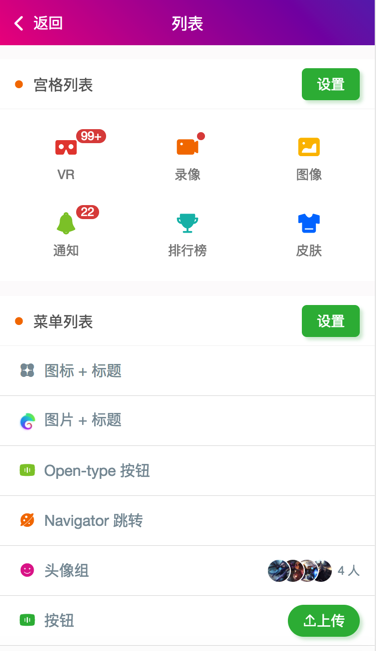

 
# 用JS任意控制手机上的APP
 

## (10分钟就可以上手)

``` 
(10分钟就可以上手)
```
帮助开发者,快速生产友好的控制脚本程序


## QQ群： 820320773

### 1. 对app的控制(10分钟就可以上手)

```js
launchApp("微信"); 
click("发现");
click("朋友圈");
sleep(3000);
click(desc("评论"));
```
[效果图1](http://robots.shen-x.com/static/git/1.jpg)，
[效果图2](http://robots.shen-x.com/static/git/3.jpg)，
[效果图3](http://robots.shen-x.com/static/git/6.jpg)，
[效果图4](http://robots.shen-x.com/static/git/5.jpg)，



 
 

# A. 开发环境

## 代码与工具
### 1. 下载安装开发工具[HbuilderX](https://www.dcloud.io/hbuilderx.html)
推荐下载使用`HbuilderX App开发版` 进行开发

### 2. 克隆或下载源码

#### a.示例项目(入门推荐) 
此方式为整个AJ_VUE演示项目，里面有Color UI组件库，演示，模板等，建议用户可以下载 此项目运行用于查看演示效果，通过里面的示例，可以快速掌握项目用法。

github地址(github)：[https://github.com/yooge/robot](https://github.com/yooge/robot)
	  
gitee地址[网速快]：[https://gitee.com/vnool/autojs-vue](https://gitee.com/vnool/autojs-vue)
	
直接下载zip包：
	  
#### b.空白项目(最小化项目，不含UI交互，高手使用)
 
项目地址：请github搜索 autojs-vue-mini

此连接为一个空白的AJ_VUE示例工程，原生ui组件，熟练开发后使用


.

# B. 运行与调试 
## 运行示例项目
### 1. 初始化项目环境配置


#### `[步骤1]`1. HbuiderX菜单 -> 运行 -> 运行到终端 -> 1.初始化/依赖包


#### `[步骤2]`2. HbuiderX菜单 -> 运行 -> 运行到终端 -> 2.更新/安装基座

#### `[步骤3]`3. HbuiderX菜单 -> 运行 -> 手机或模拟器 -> 运行基座选择 -> 自定义基座


步骤1. 初始化是为了安装`robot-tools`组件

步骤2. 安装基座，文件下载后会存放到目录unpackage/debug/android_debug.apk

步骤3. 启用调试基座(手机上的app)


* 基座是用于动态调试的APP程序。
* 如果步骤2步骤3忘记操作，会意外安装错误的手机程序，会提示Robot对象不存在

.

### 2. 执行 (调试/运行) 

#### `[步骤4]` 3.1. 运行到手机 
##### 1. USB线连接手机(需ADB生效) 
##### 2. HbuiderX菜单 -> 运行 -> 手机或模拟器 -> 选择你的手机名字

* 脚本代码，电脑上编辑，手机上可以立即运行 *

* VUE代码，电脑上编辑，手机上可以立即同步。查看效果，需要重启页面 *

* 运行到模拟器，wifi连接 (另外聊)

.
    
# C. 发布/升级，生成APK

## 打包
### 打包APK
#### `提示：每次打包或生成补丁前，需要生成app资源`

##### `[步骤]`1. HbuiderX菜单 -> 发行 -> 本地打包 -> 生成app资源
##### `[步骤]`2. HbuiderX菜单 -> 运行 -> 运行到终端 -> 生成APK


#### 自定义manifest.json文件
```js
{		
	"name" : "app名称",
	"appid" : "__UNI__xxxx", /* 一定要改!!!!! */
	"appkey" : "去官方申请!去官方申请!去官方申请",
	/* appkey去官方申请： https://nativesupport.dcloud.net.cn/AppDocs/usesdk/appkey */
	"package" : "com.xxxx.yyy", 
	"SHA1" : "BF:28:B5:FB:9D:A3:20:27:28:FD:51:77:59:9B:F4:BA:23:E8:A1:88", /* 固定值 */
	"logo" : "static/logo.png", /* APP图标，不要改名*/
	"splash" : "static/splash.png", /* 开屏等待页广告，不要改名 */

	"versionName" : "1.0.37", /* 版本号，用于热补丁更新 */
	"versionCode" : 10037,   /* 版本号，用于热补丁更新 */
  "deploy" : "release",     /* 生成正式版APK：release, 调试版基座：debug */

}
```

* appid: 在manifest操作界面上生成
* appkey: 去Hbuider官方网址申请： https://nativesupport.dcloud.net.cn/AppDocs/usesdk/appkey
* package: app的包名， 如果要一个手机上安装多个程序，需要修改这个
* SHA1:  申请appkey的时候需要用到，目前是固定值
* logo:  APP的图片
* splash: 程序启动的时候的等待页面图片
* versionCode: 当前版本号
* deploy:  app的发行类型，正式版release，还是调试基座：debug


