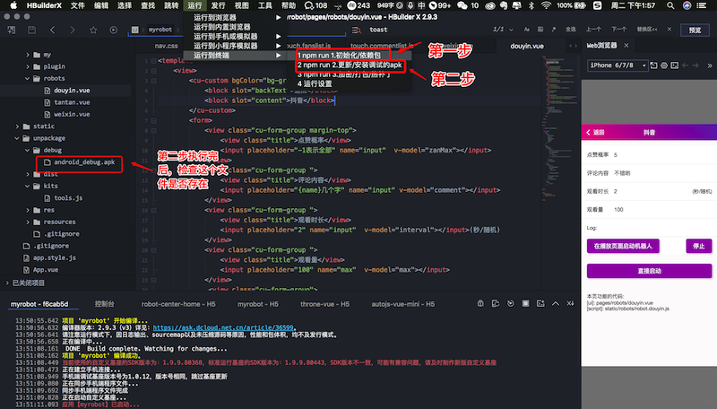

# 用JS任意控制手机上的APP

## 1. 控制代码
*  可以用如下简单的JS代码，控制手机上的第三方APP的行为，实现自动测试等目的 *

```
launchApp("微信"); 
click("发现");
click("朋友圈");
sleep(3000);
click(desc("评论"));

```

## 本项目完全兼容  uni-app + autoJs 
## [本项目完全兼容  uni-app + autoJs](https://uniapp.dcloud.net.cn/)

## 声明

```
⚠️ 警告：本项目仅供大家学习交流，请勿用于非法目的 ⚠️
⚠️ 警告：本项目之衍生产品，其用途均与本项目作者无关 ⚠️
```
## QQ群： 714554851
 
```js
  如果喜欢这个项目，可以请赠我一包华子 
```

## 2.开发环境

### 2.1 下载代码  https://github.com/yooge/robot

### 2.2 下载[NodeJs](http://www.nodejs.com.cn/)

### 2.3 下载安装开发工具[HbuilderX](https://www.dcloud.io/hbuilderx.html)

建议下载这个版本：
```
链接: https://pan.baidu.com/s/1W0IEokddywK5iqoIx7biKw?pwd=1234 
提取码: 1234
```


## 3.初始化环境
### 3.0 用Hbuilder打开项目 `(菜单/文件/打开目录)`
### 点击如图菜单可完成如下2步操作
#### 3.1 更新支持库(依赖包)，点击如下菜单，会执行 `npm i`
#### 3.2 更新运行基座，点击如下菜单，会执行 `robot-tools init`


## 4.运行程序


## 5.代码结构 ##


## QQ群：  714554851
 
```js
  如果喜欢这个项目，可以请赠我一包华子 
```